# Remote Code Agent

在沒有 public IP 的 Linux instance 或 Mac 上執行真實 PTY，透過 Cloudflare Tunnel 與 Cloudflare Access，從手機安全操作 Claude Code、Codex CLI、vim、tmux 和一般 shell。前端也部署在 Cloudflare Workers Static Assets；不使用 Firebase、Firestore 或其他資料庫。

手機端支援觸控快捷鍵、一般鍵盤、系統語音輸入，以及在文字框中使用 Wispr Flow 後「插入」或「執行」。終端連線中斷不會結束工作，因為每個工作階段都保留在 instance 的 tmux 裡。

手機快捷列也能直接上傳檔案，並一鍵開啟或切換 Claude Code、Codex CLI。每一種 agent／權限模式使用獨立的 tmux window，因此切換時不會中止另一個仍在執行的 agent。

## 文件閱讀指引

這份 README 是給人類部署者與使用者看的主要文件。請依目的閱讀：

| 對象與目的 | 指引 |
| --- | --- |
| 人類：了解系統與安全邊界 | 從「[架構與安全模型](#架構與安全模型)」開始 |
| 人類：部署服務 | 依「[事前需求](#事前需求)」至「[8. 驗證完整路徑](#8-驗證完整路徑)」依序操作 |
| 人類：使用手機介面 | 閱讀「[手機操作](#手機操作)」與「[AI 程式助理模式](#ai-程式助理模式)」 |
| 人類：開發或排錯 | 閱讀「[本機開發](#本機開發)」與「[故障排除](#故障排除)」 |
| AI Agent：開發、部署或驗收 | **先讀 [`AGENTS.md`](AGENTS.md)**，再依其中的閱讀順序查閱本 README；不要直接把範例值當成部署授權或實際設定 |

README 中的指令預設由人類判斷後執行。AI Agent 必須遵守 `AGENTS.md` 的安全限制、人工操作停駐點與回報格式。

## 架構與安全模型

```mermaid
flowchart LR
  P["手機瀏覽器<br/>鍵盤 / Wispr Flow"] --> UA["Cloudflare Access<br/>使用者登入"]
  UA --> W["Cloudflare Worker<br/>FE + Access JWT 驗證"]
  W -->|"Service Token"| OA["Cloudflare Access<br/>Service Auth"]
  OA --> T["Cloudflare Tunnel"]
  T --> C["instance 上的 cloudflared"]
  C -->|"127.0.0.1:7681"| B["PTY / WebSocket backend"]
  B --> M["持久化 tmux session"]
  M --> CLI["Claude Code / Codex / shell"]
```



部署時使用兩個不同 hostname：

- `code.example.com`：手機入口。Worker 提供前端並要求使用者通過 Access。
- `terminal-origin.example.com`：Tunnel origin。只允許 Worker 使用獨立的 Access service token 存取。

instance 不提供前端、不開 inbound port，backend 固定監聽 `127.0.0.1`。能通過 `code.example.com` Access policy 的人，等同能操作執行 backend 的 Unix 帳號，因此公開入口必須只允許可信任的身份。

## 事前需求

- 一個由 Cloudflare 管理 DNS 的網域
- Cloudflare Zero Trust organization
- Node.js 22.20.0 以上與 npm
- instance 上的 `tmux`、編譯工具，以及已安裝並登入的 `claude` 和／或 `codex`
- 開發／部署電腦已執行 `npx wrangler login`
- instance 能主動連線到 Internet；不需要 public IP

先決定自己的值，後續不要直接沿用範例：

| 名稱 | 範例 | 說明 |
| --- | --- | --- |
| `PUBLIC_HOSTNAME` | `code.example.com` | 手機入口與 Worker custom domain |
| `ORIGIN_HOSTNAME` | `terminal-origin.example.com` | Cloudflare Tunnel hostname |
| `ACCESS_TEAM_DOMAIN` | `https://your-team.cloudflareaccess.com` | Zero Trust team domain |
| `ACCESS_AUD` | `<PUBLIC_ACCESS_AUD>` | 公開入口 Access application 的 AUD |
| `WORKSPACE_DIR` | `/home/you/workspace` | 新 tmux session 的起始目錄 |

## 1. 取得專案並驗證

```bash
git clone <REPOSITORY_URL> remote-code-agent
cd remote-code-agent
npm ci
npm run check
```

`npm run check` 會檢查 Wrangler types、TypeScript、protocol tests、Workers runtime tests，以及 server/client build。

## 2. 安裝 instance backend

### Linux（systemd user service）

Ubuntu／Debian 可先安裝依賴：

```bash
sudo apt update
sudo apt install tmux build-essential python3
```

從 repo 目錄執行：

```bash
WORKSPACE_DIR=/home/you/workspace \
PUBLIC_HOSTNAME=code.example.com \
bash scripts/install-user-service.sh

sudo loginctl enable-linger "$USER"
systemctl --user status remote-code-agent
curl http://127.0.0.1:7681/healthz
```

### macOS（LaunchAgent）

先確認 Node.js、npm 和 tmux 都在目前的 `PATH`，再執行：

```bash
WORKSPACE_DIR="$HOME/Workspace" \
PUBLIC_HOSTNAME=code.example.com \
bash scripts/install-macos-service.sh

launchctl print "gui/$(id -u)/io.remote-code-agent.backend"
curl http://127.0.0.1:7681/healthz
```

若 Tunnel connector 也執行在同一台 Mac，先完成 `npx wrangler login`，再把既有 Tunnel 安裝成會隨登入自動啟動的 LaunchAgent：

```bash
TUNNEL_NAME=remote-code-agent-origin \
bash scripts/install-macos-tunnel-service.sh

launchctl print "gui/$(id -u)/io.remote-code-agent.tunnel"
npx wrangler tunnel info remote-code-agent-origin
```

Linux 與 macOS backend 安裝程式都會保留目前的 `PATH`，讓 tmux shell 能找到 Homebrew、nvm、Claude Code 與 Codex CLI。健康檢查應回傳 `{"ok":true}`。macOS Tunnel 安裝程式使用目前使用者的 Wrangler 登入狀態啟動既有 Tunnel，不會把 connector token 寫入 plist。

### Backend 設定

| Environment variable | 預設值 | 用途 |
| --- | --- | --- |
| `PORT` | `7681` | loopback HTTP port |
| `WORKSPACE_DIR` | repo 目錄 | 新 session 起始目錄 |
| `DEFAULT_SESSION` | `main` | URL 未指定 session 時使用的名稱 |
| `PUBLIC_HOSTNAME` | 空白 | Worker hostname；production 必填 |
| `TMUX_BIN` | `tmux` | tmux executable |
| `TMUX_SOCKET` | `remote-code-agent` | 專用 tmux server 名稱 |
| `TMUX_CONFIG` | `config/tmux.conf` | 可選的 tmux config 路徑 |
| `UPLOAD_DIR` | `${WORKSPACE_DIR}/.remote-code-agent/uploads` | 手機上傳檔案的儲存目錄 |
| `MAX_UPLOAD_BYTES` | `20971520` | 單一檔案上限；最大可設定為 100 MiB |

修改 Linux service 後可執行：

```bash
systemctl --user daemon-reload
systemctl --user restart remote-code-agent
```

## 3. 建立 Cloudflare Tunnel

Wrangler 可以建立、列出、檢查與測試執行 Tunnel：

```bash
npx wrangler login
npx wrangler whoami
npx wrangler tunnel create remote-code-agent-origin
npx wrangler tunnel list
npx wrangler tunnel info <TUNNEL_ID>
```

Wrangler 的 Tunnel commands 目前標示為 experimental。請記下 tunnel UUID，但不要把 credentials、connector token 或 `cert.pem` 加入 repo。

接著在 Cloudflare dashboard 的 **Networking → Tunnels** 選擇該 Tunnel，新增 **Published application**：

- Hostname：`terminal-origin.example.com`
- Service URL：`http://127.0.0.1:7681`

在開發電腦測試 connector：

```bash
npx wrangler tunnel run <TUNNEL_ID>
```

正式 instance 請依 Tunnel 頁面提供的 connector 安裝流程，把 `cloudflared` 安裝成 system service。connector token 是 secret：只能在目標主機使用，不要貼進 README、issue、AI 對話、shell script 或 Git。確認 Dashboard 狀態為 `Healthy` 後再繼續。

> Wrangler 適合管理 Worker、Static Assets、secrets、部署，以及 Tunnel 的 create/list/info/run。Published application route 和 Access policy 目前用 Dashboard 設定最直接；若要全自動化，可另外使用 Cloudflare API，但仍應透過 secret manager 傳入 API token。

官方文件：[Cloudflare Tunnel](https://developers.cloudflare.com/cloudflare-one/networks/connectors/cloudflare-tunnel/) 與 [Wrangler commands](https://developers.cloudflare.com/workers/wrangler/commands/)。

## 4. 用 Access 保護 Tunnel origin

先建立只給 Worker 使用的 service token：

1. 到 **Zero Trust → Access controls → Service credentials → Service Tokens**。
2. 建立一組 token，安全保存只顯示一次的 Client ID 與 Client Secret。
3. 新增 Self-hosted Access application，domain 設為 `terminal-origin.example.com`。
4. 新增 policy：Action 選 **Service Auth**，Include 選剛建立的 service token。
5. 不要新增 `Everyone` 或 bypass policy。

此 hostname 不供使用者直接登入。未帶正確 service token 的請求必須被拒絕。

官方文件：[Access service tokens](https://developers.cloudflare.com/cloudflare-one/access-controls/service-credentials/service-tokens/)。

## 5. 建立手機入口 Access application

1. 新增另一個 Self-hosted Access application，domain 設為 `code.example.com`。
2. 新增 `Allow` policy，只 Include 自己的 email、群組或可信任的 IdP identity。
3. 記下 application 的 **Application Audience (AUD) Tag**。
4. 建議縮短 session duration，並在 IdP 啟用 MFA。

Worker 除了依賴 Cloudflare Access，還會自行驗證 `Cf-Access-Jwt-Assertion` 的簽章、issuer 與 AUD，之後才會把 WebSocket 代理到 origin。

官方文件：[Validate Access tokens](https://developers.cloudflare.com/cloudflare-one/access-controls/applications/http-apps/authorization-cookie/validating-json/)。

## 6. 建立不進 Git 的 production 設定

repo 中的 `wrangler.jsonc` 是無個資、可公開的本機開發範本。production 設定必須使用被 `.gitignore` 排除的檔案：

```bash
cp wrangler.jsonc wrangler.production.jsonc
```

在 `wrangler.production.jsonc` 做三件事：

1. 將 `workers_dev` 改成 `false`。
2. 加入自己的 custom domain route。
3. 換掉三個 placeholder vars。

```jsonc
{
  "workers_dev": false,
  "routes": [
    {
      "pattern": "code.example.com",
      "custom_domain": true
    }
  ],
  "vars": {
    "ORIGIN_URL": "https://terminal-origin.example.com",
    "LOCAL_ORIGIN_URL": "http://127.0.0.1:7681",
    "ACCESS_TEAM_DOMAIN": "https://your-team.cloudflareaccess.com",
    "ACCESS_AUD": "<PUBLIC_ACCESS_AUD>"
  }
}
```

實際檔案仍需保留原範本中的 `main`、`assets`、`secrets` 和 `observability` 等其他欄位。確認它不會被 Git 追蹤：

```bash
git check-ignore -v wrangler.production.jsonc
```

網域、team name 與 AUD 通常不是密碼，但仍可能識別個人或基礎設施，所以本專案將 production config 一併視為 private。

## 7. 安全寫入 Worker secrets 並部署

以下指令會互動式要求輸入值；不要把 secret 放在 command argument：

```bash
npx wrangler secret put ACCESS_CLIENT_ID --config wrangler.production.jsonc
npx wrangler secret put ACCESS_CLIENT_SECRET --config wrangler.production.jsonc
```

先做 dry run，再正式部署 FE、Worker 與 custom domain：

```bash
npm run deploy:dry-run
npm run deploy:cloudflare
```

Static Assets 與 Worker 會一起部署，不需要 Cloudflare Pages project。靜態檔由 edge 提供，只有 `/ws`、`/healthz` 和 `/api/*` 會經 Worker 代理到 Tunnel origin。

若只更新程式碼，保留 `wrangler.production.jsonc` 後再次執行 `npm run deploy:cloudflare` 即可；secrets 不需重複寫入。

## 8. 驗證完整路徑

依序檢查，避免把 Access、Tunnel 與 backend 問題混在一起：

```bash
# 在 instance：必須成功
curl http://127.0.0.1:7681/healthz

# 在其他機器：origin 未帶 service token 必須被拒絕，而不是回 backend 200
curl -i https://terminal-origin.example.com/healthz

# 公開入口未登入時應導向 Access 或被拒絕
curl -I https://code.example.com

# Tunnel connector 狀態
npx wrangler tunnel info <TUNNEL_ID>
```

最後用手機瀏覽器開啟 `https://code.example.com`：

1. 完成 Access 登入。
2. 確認右上角顯示已連線。
3. 執行 `pwd`、`tmux display-message -p '#S'`。
4. 啟動 `claude` 或 `codex`，測試互動、方向鍵、Ctrl-C 和外部 OAuth URL。
5. 關閉分頁再重新開啟，確認原 tmux 工作仍在。

## 手機操作

- 快捷列最前方的 Claude 與 Codex 按鈕會以目前選定的模式一鍵開啟；再次點擊會切回既有的 tmux window。
- 右上角的 `EN`／`繁中` 按鈕可切換 `en-US` 與 `zh-TW`；選擇會保存在目前瀏覽器。
- 點「模式」可分別設定兩個 CLI 的啟動模式。選擇會保存在目前瀏覽器；停用安全防護的模式每次啟動前都會再次確認。
- 點「上傳」可從手機選擇一個或多個檔案。上傳完成後，主機上的絕對路徑會放進底部輸入區，接著補上指令並按「執行」即可交給目前的 Claude／Codex。
- 點終端機即可用手機鍵盤輸入。
- 快捷列的 `Enter` 可直接確認互動式選單；底部輸入區空白時按「執行」也等同按下 Enter。
- 在終端內容上單指上下滑動可查看先前輸出；固定 80 欄模式仍可左右滑動。
- 快捷列提供 Ctrl、Alt、Esc、Tab、方向鍵與常用控制鍵組合。
- 底部輸入區可接收 Wispr Flow 或系統語音輸入；「輸入」只送出文字，「執行」會再送出 Enter。
- 工具列的欄寬按鈕可在自動符合畫面寬度與固定 80 欄之間切換。遇到 Claude Code 或 Codex TUI 在窄手機上跑版時，優先使用固定 80 欄並左右滑動查看。
- 可用瀏覽器的「加入主畫面」取得更接近 App 的全螢幕體驗。
- OAuth、文件或其他終端網址可直接點開。

登入憑證、repo 與命令執行都留在 instance；瀏覽器只接收終端輸出並傳送鍵盤事件。

### AI 程式助理模式

介面只會送出後端內建的允許模式，不接受瀏覽器提供任意指令或啟動參數：

| CLI | 模式 | 實際啟動策略 |
| --- | --- | --- |
| Claude Code | 一般 | `--permission-mode manual` |
| Claude Code | 自動 | `--permission-mode auto` |
| Claude Code | 規劃 | `--permission-mode plan` |
| Claude Code | 略過檢查 | `--dangerously-skip-permissions` |
| Codex CLI | 一般 | workspace-write sandbox，未信任命令需確認 |
| Codex CLI | 唯讀 | read-only sandbox，不要求確認 |
| Codex CLI | 自動 | workspace-write sandbox，不逐次詢問 |
| Codex CLI | 完全存取 | `--dangerously-bypass-approvals-and-sandbox` |

「略過檢查」與「完全存取」只應在額外隔離、可承受完整主機權限的環境使用。手機上的模式切換不會動態修改已在執行中的 CLI，而是開啟或切換到對應的 tmux window，行為較可預期。

### 手機上傳檔案

上傳走同一個受 Cloudflare Access 保護的 `/api/upload` 路徑，再由 Worker 經 Tunnel 寫入 instance。backend 會驗證 session、限制大小、清理檔名，並以 `0700` 目錄與 `0600` 檔案權限儲存。檔案不會自動加入 Git，也不會自動刪除；完成後可自行清理 `UPLOAD_DIR`。

### 多個持久化 session

介面上方的 session 分頁列可新增、切換與關閉多個開發工作。每個分頁各自保留終端輸出與指令草稿，所有分頁則共用一條 WebSocket，透過 session-tagged 訊息在 backend 分流到各自的 PTY。這可避免每新增一個分頁就重做 Access、Worker、Tunnel 與 WebSocket handshake；背景 session 仍會持續執行，關閉分頁也只會解除瀏覽器訂閱，不會終止對應的 tmux session。

分頁清單會保存在目前瀏覽器，重新載入後自動恢復。連線包含 handshake timeout 與應用層 heartbeat；手機切換 App、頁面從 back-forward cache 恢復或網路重新上線時，前端會檢查共用連線並在必要時重新連線，再自動訂閱所有已開啟的 session。

預設 session 是 `main`。目前分頁也會同步到 query parameter，可直接建立或接回其他 session：

```text
https://code.example.com/?session=my-project
```

名稱只允許英數字、`_`、`-`，最長 64 字元。也可直接在 instance 管理專用 tmux server：

```bash
tmux -L remote-code-agent list-sessions
tmux -L remote-code-agent attach -t main
```

## 本機開發

開兩個 terminal：

```bash
# Terminal 1：loopback backend
npm run dev

# Terminal 2：Worker + Static Assets
npm run dev:cloudflare
```

開啟 Wrangler 顯示的 localhost URL。本機 localhost 流量只會代理到 `LOCAL_ORIGIN_URL`，並略過 Access；部署後不會使用這條路徑。若需要本機 vars，可複製 `.dev.vars.example` 為 `.dev.vars`，但不要 commit `.dev.vars`。

常用檢查：

```bash
npm run check
npm run types:worker
npm run build:client:production
```

## 故障排除

### 頁面正常但終端顯示未連線

按順序檢查：

1. instance 的 `curl http://127.0.0.1:7681/healthz`。
2. Tunnel 是否 `Healthy`，Published application 是否指向正確 loopback port。
3. origin Access policy 是否為 Service Auth，且 Worker secrets 對應同一組 token。
4. Worker 的 `ORIGIN_URL` 是否與 origin hostname 完全一致。
5. backend 的 `PUBLIC_HOSTNAME` 是否為公開 Worker hostname，而不是 origin hostname。

macOS 若 Tunnel 顯示 `down`，確認常駐服務已啟動：

```bash
launchctl print "gui/$(id -u)/io.remote-code-agent.tunnel"
tail -n 100 "$HOME/Library/Logs/remote-code-agent-tunnel.error.log"
```

查看 Worker 即時 log：

```bash
npx wrangler tail --config wrangler.production.jsonc
```

### 瀏覽器出現 401

確認公開 hostname 已套用 Access application，`ACCESS_TEAM_DOMAIN` 是完整的 `https://...cloudflareaccess.com`，而 `ACCESS_AUD` 來自公開入口 application，不是 origin application。

### origin 回 403、502 或無法連線

- `403`：通常是 service token 或 origin Access policy 不匹配。
- `502`：通常是 Tunnel connector 不健康、Published application 指錯 port，或 backend 沒有啟動。
- instance 本機 health 成功但 Tunnel 失敗：檢查 cloudflared service log 與 ingress route。

### TUI 跑版或字元重疊

切換成固定 80 欄、旋轉成橫向、重新整理頁面。終端會把 resize 傳到 PTY；tmux 與 TUI 需要幾秒重新繪製。若仍有殘影，可在 shell 執行 `reset`，或在程式內觸發完整 redraw。

## AI Agent 指引

AI Agent 專用的開發、部署、使用驗收、安全限制與人工操作停駐點已集中在 [`AGENTS.md`](AGENTS.md)。人類不需要照著該文件逐項操作；若要把部署交給 Agent，請直接要求它先讀取並遵守 `AGENTS.md`，同時提供文件列出的必要部署資訊。

## 機密與個資清單

以下內容永遠不應 commit：

- `.env`、`.dev.vars` 和任何 local override
- `wrangler.production.jsonc` 與 private Wrangler configs
- Cloudflare API token、Access service token、Tunnel token 與 credentials JSON
- `cert.pem`、private keys、service-account files
- Claude Code、Codex、npm、GitHub 或其他 CLI 的 login credentials
- 實際 email、私人網域、account／zone／tunnel IDs，以及其他可識別部署的值

commit 前至少執行：

```bash
git status --short --ignored
git diff --cached
git grep --cached -n -I -E 'BEGIN (RSA |EC |OPENSSH )?PRIVATE KEY|[[:xdigit:]]{32}\.access|gh[pousr]_[A-Za-z0-9_]{20,}|sk-[A-Za-z0-9]{20,}' -- .
```

最後一個指令沒有輸出才是預期結果。即使 `.gitignore` 已設定，也不要用 `git add -f` 強制加入 private files。

## 專案結構

```text
src/server.ts                 loopback PTY/WebSocket backend
src/worker.ts                 Access JWT 驗證、assets 與 Tunnel proxy
src/client.ts                 xterm.js mobile client
src/client.css                responsive UI
config/tmux.conf              detached session 設定
scripts/install-user-service.sh   Linux systemd installer
scripts/install-macos-service.sh  macOS LaunchAgent installer
AGENTS.md                     AI Agent 開發、部署與驗收指引
wrangler.jsonc                可公開的安全範本
wrangler.production.jsonc     本機 production 設定，已 gitignore
```

## 貢獻與安全

歡迎 bug fix、文件改善與範圍明確的功能提案。開始前請閱讀 [`CONTRIBUTING.md`](CONTRIBUTING.md)；所有 pull request 都必須通過 `npm run check`，且不得包含 production hostname、email、token、credential 或其他可識別部署的資料。

安全漏洞請依 [`SECURITY.md`](SECURITY.md) 私下回報，不要建立公開 issue。社群互動適用 [`CODE_OF_CONDUCT.md`](CODE_OF_CONDUCT.md)。

## License

專案原始碼採用 [MIT License](LICENSE)。第三方套件仍適用各自的授權；確切版本記錄於 `package-lock.json`。

`package.json` 的 `"private": true` 是為了避免把這個可部署應用程式誤發佈到 npm，不限制依 MIT License 使用、修改或散布原始碼。

Remote Code Agent 是獨立的社群專案，並非 Anthropic、Cloudflare 或 OpenAI 的官方產品，也未獲其背書。
