# Remote Code Agent

**English** · [繁體中文](docs/README.zh-TW.md) · [简体中文](docs/README.zh-CN.md) · [日本語](docs/README.ja.md)

Run a real PTY on a Linux instance or Mac without a public IP, then securely operate Claude Code, Codex CLI, vim, tmux, and a regular shell from your phone through Cloudflare Tunnel and Cloudflare Access. The frontend is deployed with Cloudflare Workers Static Assets. No Firebase, Firestore, or other database is required.

The mobile client supports touch shortcuts, a regular keyboard, system dictation, and text composed with tools such as Wispr Flow. Terminal disconnects do not stop work because every session remains attached to tmux on the instance.

You can upload files from the mobile toolbar and open or switch between Claude Code and Codex CLI with one tap. Each agent and permission mode uses a separate tmux window, so switching modes does not interrupt another agent that is still running.

## Documentation map

This is the canonical guide for human operators and users. Translations are provided for convenience; if a translation differs from this file, follow the English deployment and security guidance.

| Audience and goal | Start here |
| --- | --- |
| Human: understand the system and trust boundaries | [Architecture and security model](#architecture-and-security-model) |
| Human: deploy the service | Follow [Prerequisites](#prerequisites) through [8. Verify the complete path](#8-verify-the-complete-path) in order |
| Human: use the mobile interface | [Mobile usage](#mobile-usage) and [AI coding-agent modes](#ai-coding-agent-modes) |
| Human: develop or troubleshoot | [Local development](#local-development) and [Troubleshooting](#troubleshooting) |
| AI agent: develop, deploy, or validate | Read [`AGENTS.md`](AGENTS.md) first, then follow its reading order for this README |

Commands in this README are intended for a human to review before running. AI agents must obey the safety limits, human handoff points, and reporting requirements in `AGENTS.md`. Example values are not deployment authorization or production configuration.

## Architecture and security model

```mermaid
flowchart LR
  P["Mobile browser<br/>Keyboard / dictation"] --> UA["Cloudflare Access<br/>User sign-in"]
  UA --> W["Cloudflare Worker<br/>Frontend + Access JWT validation"]
  W -->|"Service token"| OA["Cloudflare Access<br/>Service Auth"]
  OA --> T["Cloudflare Tunnel"]
  T --> C["cloudflared on the instance"]
  C -->|"127.0.0.1:7681"| B["PTY / WebSocket backend"]
  B --> M["Persistent tmux session"]
  M --> CLI["Claude Code / Codex / shell"]
```



The deployment uses two distinct hostnames:

- `code.example.com` is the mobile entry point. The Worker serves the frontend and requires the user to pass Access authentication.
- `terminal-origin.example.com` is the Tunnel origin. It accepts only the Worker's dedicated Access service token.

The instance does not serve the frontend or expose an inbound port. The backend is fixed to `127.0.0.1`. Anyone allowed through the `code.example.com` Access policy can effectively operate the Unix account that runs the backend, so restrict the public entry point to trusted identities.

## Prerequisites

- A domain whose DNS is managed by Cloudflare
- A Cloudflare Zero Trust organization
- Node.js 22.20.0 or newer and npm
- `tmux`, build tools, and an authenticated `claude` and/or `codex` installation on the instance
- `npx wrangler login` completed on the development or deployment machine
- Outbound Internet access from the instance; no public IP is required

Choose your own values before continuing. Do not reuse the examples unchanged:

| Name | Example | Purpose |
| --- | --- | --- |
| `PUBLIC_HOSTNAME` | `code.example.com` | Mobile entry point and Worker custom domain |
| `ORIGIN_HOSTNAME` | `terminal-origin.example.com` | Cloudflare Tunnel hostname |
| `ACCESS_TEAM_DOMAIN` | `https://your-team.cloudflareaccess.com` | Zero Trust team domain |
| `ACCESS_AUD` | `<PUBLIC_ACCESS_AUD>` | AUD of the public-entry Access application |
| `WORKSPACE_DIR` | `/home/you/workspace` | Starting directory for new tmux sessions |

## 1. Get the project and verify it

```bash
git clone <REPOSITORY_URL> remote-code-agent
cd remote-code-agent
npm ci
npm run check
```

`npm run check` verifies Wrangler-generated types, TypeScript, protocol tests, Workers runtime tests, and the server/client builds.

## 2. Install the instance backend

### Linux: systemd user service

On Ubuntu or Debian, install the runtime dependencies first:

```bash
sudo apt update
sudo apt install tmux build-essential python3
```

From the repository directory:

```bash
WORKSPACE_DIR=/home/you/workspace \
PUBLIC_HOSTNAME=code.example.com \
bash scripts/install-user-service.sh

sudo loginctl enable-linger "$USER"
systemctl --user status remote-code-agent
curl http://127.0.0.1:7681/healthz
```

### macOS: LaunchAgent

Make sure Node.js, npm, and tmux are available on the current `PATH`, then run:

```bash
WORKSPACE_DIR="$HOME/Workspace" \
PUBLIC_HOSTNAME=code.example.com \
bash scripts/install-macos-service.sh

launchctl print "gui/$(id -u)/io.remote-code-agent.backend"
curl http://127.0.0.1:7681/healthz
```

If the Tunnel connector also runs on the same Mac, complete `npx wrangler login` and install an existing Tunnel as a login LaunchAgent:

```bash
TUNNEL_NAME=remote-code-agent-origin \
bash scripts/install-macos-tunnel-service.sh

launchctl print "gui/$(id -u)/io.remote-code-agent.tunnel"
npx wrangler tunnel info remote-code-agent-origin
```

Both backend installers preserve the current `PATH`, allowing tmux shells to find Homebrew, nvm, Claude Code, and Codex CLI. The health check should return `{"ok":true}`. The macOS Tunnel installer uses the current user's Wrangler login to start an existing Tunnel and does not write a connector token into the plist.

### Backend configuration

| Environment variable | Default | Purpose |
| --- | --- | --- |
| `PORT` | `7681` | Loopback HTTP port |
| `WORKSPACE_DIR` | Repository directory | Starting directory for new sessions |
| `DEFAULT_SESSION` | `main` | Session used when the URL has no session parameter |
| `PUBLIC_HOSTNAME` | Empty | Worker hostname; required in production |
| `TMUX_BIN` | `tmux` | tmux executable |
| `TMUX_SOCKET` | `remote-code-agent` | Dedicated tmux server name |
| `TMUX_CONFIG` | `config/tmux.conf` | Optional tmux configuration path |
| `UPLOAD_DIR` | `${WORKSPACE_DIR}/.remote-code-agent/uploads` | Storage directory for mobile uploads |
| `MAX_UPLOAD_BYTES` | `20971520` | Per-file limit; configurable up to 100 MiB |

After changing the Linux service configuration:

```bash
systemctl --user daemon-reload
systemctl --user restart remote-code-agent
```

## 3. Create the Cloudflare Tunnel

Wrangler can create, list, inspect, and test-run a Tunnel:

```bash
npx wrangler login
npx wrangler whoami
npx wrangler tunnel create remote-code-agent-origin
npx wrangler tunnel list
npx wrangler tunnel info <TUNNEL_ID>
```

Wrangler currently marks its Tunnel commands as experimental. Record the Tunnel UUID, but never add credentials, connector tokens, or `cert.pem` to the repository.

In the Cloudflare dashboard, open **Networking → Tunnels**, select the Tunnel, and add a **Published application**:

- Hostname: `terminal-origin.example.com`
- Service URL: `http://127.0.0.1:7681`

Test the connector from the development machine:

```bash
npx wrangler tunnel run <TUNNEL_ID>
```

For production, use the connector installation flow shown on the Tunnel page to install `cloudflared` as a system service on the instance. The connector token is a secret: use it only on the target host, and never paste it into a README, issue, AI conversation, shell script, or Git. Continue only after the dashboard reports the connector as `Healthy`.

> Wrangler is suitable for Workers, Static Assets, secrets, deployments, and Tunnel create/list/info/run operations. The dashboard is currently the most direct way to configure Published application routes and Access policies. If you automate them with the Cloudflare API, inject API tokens through a secret manager.

Official documentation: [Cloudflare Tunnel](https://developers.cloudflare.com/cloudflare-one/networks/connectors/cloudflare-tunnel/) and [Wrangler commands](https://developers.cloudflare.com/workers/wrangler/commands/).

## 4. Protect the Tunnel origin with Access

Create a service token used only by the Worker:

1. Open **Zero Trust → Access controls → Service credentials → Service Tokens**.
2. Create a token and securely store the Client ID and Client Secret, which are shown only once.
3. Add a Self-hosted Access application for `terminal-origin.example.com`.
4. Add a policy with **Service Auth** as the action and the new service token as the Include rule.
5. Do not add an `Everyone` or bypass policy.

This hostname is not for direct user sign-in. Requests without the correct service token must be rejected.

Official documentation: [Access service tokens](https://developers.cloudflare.com/cloudflare-one/access-controls/service-credentials/service-tokens/).

## 5. Create the mobile-entry Access application

1. Add a separate Self-hosted Access application for `code.example.com`.
2. Add an `Allow` policy that includes only your email, group, or trusted IdP identity.
3. Record the application's **Application Audience (AUD) Tag**.
4. Prefer a short session duration and enable MFA in the IdP.

In addition to Cloudflare Access enforcement, the Worker validates the signature, issuer, and AUD of `Cf-Access-Jwt-Assertion` before proxying a WebSocket to the origin.

Official documentation: [Validate Access tokens](https://developers.cloudflare.com/cloudflare-one/access-controls/applications/http-apps/authorization-cookie/validating-json/).

## 6. Create a production configuration that stays out of Git

The tracked `wrangler.jsonc` is a sanitized local-development template. Production configuration must use the ignored file:

```bash
cp wrangler.jsonc wrangler.production.jsonc
```

Make three changes in `wrangler.production.jsonc`:

1. Set `workers_dev` to `false`.
2. Add your custom-domain route.
3. Replace the placeholder variables.

```jsonc
{
  "workers_dev": false,
  "routes": [
    {
      "pattern": "code.example.com",
      "custom_domain": true
    }
  ],
  "vars": {
    "ORIGIN_URL": "https://terminal-origin.example.com",
    "LOCAL_ORIGIN_URL": "http://127.0.0.1:7681",
    "ACCESS_TEAM_DOMAIN": "https://your-team.cloudflareaccess.com",
    "ACCESS_AUD": "<PUBLIC_ACCESS_AUD>"
  }
}
```

Keep the template's other fields, including `main`, `assets`, `secrets`, and `observability`. Confirm that Git ignores the production file:

```bash
git check-ignore -v wrangler.production.jsonc
```

Domains, team names, and AUD values are not usually passwords, but they can identify a person or deployment. This project therefore treats the complete production configuration as private.

## 7. Write Worker secrets safely and deploy

These commands prompt for values interactively. Never place a secret in a command argument:

```bash
npx wrangler secret put ACCESS_CLIENT_ID --config wrangler.production.jsonc
npx wrangler secret put ACCESS_CLIENT_SECRET --config wrangler.production.jsonc
```

Run a dry run before deploying the frontend, Worker, and custom domain:

```bash
npm run deploy:dry-run
npm run deploy:cloudflare
```

Static Assets and the Worker deploy together; no Cloudflare Pages project is required. The edge serves static files, while only `/ws`, `/healthz`, and `/api/*` are proxied through the Worker to the Tunnel origin.

For later code-only updates, keep `wrangler.production.jsonc` and run `npm run deploy:cloudflare` again. Existing secrets do not need to be re-entered.

## 8. Verify the complete path

Check each layer in order so Access, Tunnel, and backend failures do not get mixed together:

```bash
# On the instance: must succeed
curl http://127.0.0.1:7681/healthz

# From another machine: must be rejected without the service token,
# rather than returning backend 200
curl -i https://terminal-origin.example.com/healthz

# The public entry point should redirect to Access or reject the request
curl -I https://code.example.com

# Tunnel connector status
npx wrangler tunnel info <TUNNEL_ID>
```

Finally, open `https://code.example.com` in a mobile browser:

1. Complete Access sign-in.
2. Confirm that the top-right status shows a connection.
3. Run `pwd` and `tmux display-message -p '#S'`.
4. Start `claude` or `codex`; test interaction, arrow keys, Ctrl-C, and an external OAuth URL.
5. Close and reopen the tab, then confirm that the original tmux work is still running.

## Mobile usage

- The Claude and Codex buttons at the start of the toolbar open the selected mode with one tap. Tapping again returns to its existing tmux window.
- The `EN` / `繁中` button switches the interface between `en-US` and `zh-TW`. The choice is saved in the current browser.
- **Mode** configures the startup mode for each CLI. The choice is saved locally, while unsafe modes require confirmation every time they are started.
- **Upload** selects one or more files. After upload, absolute paths on the instance appear in the bottom input area so you can append a command and run it with the active agent.
- Tap the terminal to type with the mobile keyboard.
- The toolbar's `Enter` confirms interactive menus. When the bottom input is empty, **Run** also sends Enter.
- Swipe vertically over terminal content to inspect earlier output. Fixed 80-column mode also supports horizontal scrolling.
- The toolbar includes Ctrl, Alt, Esc, Tab, arrow keys, and common control-key combinations.
- The bottom input accepts system dictation or Wispr Flow. **Insert** sends text only; **Run** sends the text followed by Enter.
- Toggle between automatic width and fixed 80 columns. Fixed width plus horizontal scrolling is often more reliable for Claude Code or Codex TUIs on narrow screens.
- Add the site to the home screen for a more app-like full-screen experience.
- OAuth, documentation, and other terminal URLs are directly clickable.

Login credentials, repositories, and command execution stay on the instance. The browser receives terminal output and sends keyboard events only.

### AI coding-agent modes

The client can select only backend-defined modes. It cannot supply an arbitrary command or startup argument.

| CLI | Mode | Launch policy |
| --- | --- | --- |
| Claude Code | Manual | `--permission-mode manual` |
| Claude Code | Auto | `--permission-mode auto` |
| Claude Code | Plan | `--permission-mode plan` |
| Claude Code | Skip checks | `--dangerously-skip-permissions` |
| Codex CLI | Standard | Workspace-write sandbox; asks before untrusted commands |
| Codex CLI | Read only | Read-only sandbox; no approval prompts |
| Codex CLI | Auto | Workspace-write sandbox; no per-command prompts |
| Codex CLI | Full access | `--dangerously-bypass-approvals-and-sandbox` |

Use **Skip checks** and **Full access** only in an additional isolation boundary where full host access is acceptable. Changing a mode on the phone does not mutate an already running CLI. Instead, it opens or switches to the tmux window for that agent/mode combination.

### Mobile file uploads

Uploads use the Access-protected `/api/upload` route and travel through the Worker and Tunnel to the instance. The backend validates the session, enforces size limits, sanitizes filenames, and stores directories with `0700` and files with `0600` permissions. Uploaded files are not added to Git or deleted automatically; clean `UPLOAD_DIR` when appropriate.

### Multiple persistent sessions

The session tab bar can create, switch, and close multiple development sessions. Each tab keeps its own terminal output and command draft. All tabs share one WebSocket, with session-tagged messages routed by the backend to the correct PTY. Background sessions continue running, and closing a tab unsubscribes the browser without terminating its tmux session.

The tab list is stored in the current browser and restored after reload. The connection includes a handshake timeout and application-level heartbeat. When the phone changes apps, restores the page from the back-forward cache, or reconnects to the network, the client checks the shared connection, reconnects if needed, and resubscribes to every open session.

The default session is `main`. The current tab is mirrored in the query parameter, so a link can create or reconnect to another session:

```text
https://code.example.com/?session=my-project
```

Names may contain letters, digits, `_`, and `-`, up to 64 characters. You can also manage the dedicated tmux server directly on the instance:

```bash
tmux -L remote-code-agent list-sessions
tmux -L remote-code-agent attach -t main
```

## Local development

Run two terminals:

```bash
# Terminal 1: loopback backend
npm run dev

# Terminal 2: Worker + Static Assets
npm run dev:cloudflare
```

Open the localhost URL printed by Wrangler. Localhost traffic is proxied only to `LOCAL_ORIGIN_URL` and bypasses Access; the deployed application does not use this path. If you need local variables, copy `.dev.vars.example` to `.dev.vars`, but never commit `.dev.vars`.

Useful checks:

```bash
npm run check
npm run types:worker
npm run build:client:production
```

## Troubleshooting

### The page loads, but the terminal is disconnected

Check these layers in order:

1. `curl http://127.0.0.1:7681/healthz` on the instance.
2. The Tunnel is `Healthy`, and its Published application points to the correct loopback port.
3. The origin Access policy uses Service Auth, and the Worker secrets belong to that service token.
4. The Worker's `ORIGIN_URL` exactly matches the origin hostname.
5. The backend's `PUBLIC_HOSTNAME` is the public Worker hostname, not the origin hostname.

If the Tunnel reports `down` on macOS, inspect the persistent service:

```bash
launchctl print "gui/$(id -u)/io.remote-code-agent.tunnel"
tail -n 100 "$HOME/Library/Logs/remote-code-agent-tunnel.error.log"
```

Stream Worker logs with:

```bash
npx wrangler tail --config wrangler.production.jsonc
```

### The browser returns 401

Confirm that the public hostname has an Access application, `ACCESS_TEAM_DOMAIN` is the full `https://...cloudflareaccess.com` domain, and `ACCESS_AUD` belongs to the public-entry application rather than the origin application.

### The origin returns 403, 502, or cannot connect

- `403` usually means the service token and origin Access policy do not match.
- `502` usually means the Tunnel connector is unhealthy, the Published application points to the wrong port, or the backend is stopped.
- If local health succeeds but the Tunnel fails, inspect the cloudflared service log and ingress route.

### The TUI is misaligned or characters overlap

Switch to fixed 80 columns, rotate to landscape, and refresh. Terminal resizing propagates to the PTY, and tmux or a TUI may need a few seconds to redraw. If artifacts remain, run `reset` in the shell or trigger a full redraw in the application.

## AI agent guidance

Development, deployment, acceptance, safety limits, and human handoff requirements for AI agents are centralized in [`AGENTS.md`](AGENTS.md). Human operators do not need to execute that file step by step. To delegate a deployment, tell the agent to read and follow `AGENTS.md`, then provide the required deployment inputs listed there.

## Secrets and personal data

Never commit any of the following:

- `.env`, `.dev.vars`, or any local override
- `wrangler.production.jsonc` or another private Wrangler configuration
- Cloudflare API tokens, Access service tokens, Tunnel tokens, or credentials JSON
- `cert.pem`, private keys, or service-account files
- Claude Code, Codex, npm, GitHub, or other CLI login credentials
- Real email addresses, private domains, account/zone/Tunnel IDs, or other deployment-identifying values

At minimum, run these checks before committing:

```bash
git status --short --ignored
git diff --cached
git grep --cached -n -I -E 'BEGIN (RSA |EC |OPENSSH )?PRIVATE KEY|[[:xdigit:]]{32}\.access|gh[pousr]_[A-Za-z0-9_]{20,}|sk-[A-Za-z0-9]{20,}' -- .
```

The final command should print nothing. Never use `git add -f` to add a private file even when `.gitignore` is configured.

## Project structure

```text
src/server.ts                     loopback PTY/WebSocket backend
src/worker.ts                     Access JWT validation, assets, and Tunnel proxy
src/client.ts                     xterm.js mobile client
src/client.css                    responsive interface
config/tmux.conf                  detached-session configuration
scripts/install-user-service.sh   Linux systemd installer
scripts/install-macos-service.sh  macOS LaunchAgent installer
AGENTS.md                         AI-agent development and deployment guidance
wrangler.jsonc                    sanitized public template
wrangler.production.jsonc         ignored local production configuration
```

## Contributing and security

Bug fixes, documentation improvements, and well-scoped feature proposals are welcome. Read [`CONTRIBUTING.md`](CONTRIBUTING.md) before starting. Every pull request must pass `npm run check` and must not contain a production hostname, email address, token, credential, or other deployment-identifying data.

Report vulnerabilities privately according to [`SECURITY.md`](SECURITY.md); do not open a public issue. Community participation is governed by [`CODE_OF_CONDUCT.md`](CODE_OF_CONDUCT.md).

## License

The project source is available under the [MIT License](LICENSE). Third-party packages remain subject to their own licenses; exact versions are recorded in `package-lock.json`.

`"private": true` in `package.json` prevents accidental publication of this deployable application to npm. It does not restrict use, modification, or distribution under the MIT License.

Remote Code Agent is an independent community project. It is not an official product of, or endorsed by, Anthropic, Cloudflare, or OpenAI.
