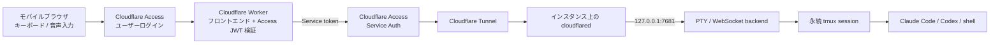

# Remote Code Agent

[English](../README.md) · [繁體中文](README.zh-TW.md) · [简体中文](README.zh-CN.md) · **日本語**

> この翻訳は参照用です。英語版と内容が異なる場合は、[English README](../README.md) のデプロイおよびセキュリティ手順を優先してください。

パブリック IP を持たない Linux インスタンスまたは Mac で実際の PTY を実行し、Cloudflare Tunnel と Cloudflare Access を経由して、スマートフォンから Claude Code、Codex CLI、vim、tmux、通常のシェルを安全に操作します。フロントエンドは Cloudflare Workers Static Assets で配信され、Firebase、Firestore、その他のデータベースは使用しません。

モバイルクライアントはタッチ用ショートカット、通常のキーボード、システム音声入力、Wispr Flow などで作成したテキストに対応します。各セッションはインスタンス上の tmux に保持されるため、接続が切れても処理は終了しません。ファイルのアップロードや Claude Code／Codex CLI のワンタップ切り替えにも対応し、agent と権限モードの組み合わせごとに独立した tmux window を使用します。

## ドキュメントガイド

| 目的 | 参照先 |
| --- | --- |
| アーキテクチャと信頼境界を理解する | [アーキテクチャとセキュリティモデル](#アーキテクチャとセキュリティモデル) |
| サービスをデプロイする | [前提条件](#前提条件)から[8-経路全体を検証する](#8-経路全体を検証する)まで順番に実施 |
| モバイル UI を使う | [モバイル操作](#モバイル操作)と [AI コーディング agent のモード](#ai-コーディング-agent-のモード) |
| ローカル開発やトラブルシュート | [ローカル開発](#ローカル開発)と[トラブルシューティング](#トラブルシューティング) |
| AI agent に作業を依頼する | 最初に [`AGENTS.md`](../AGENTS.md) を読む |

README のコマンドは、人間が内容を確認してから実行することを前提としています。AI agent は `AGENTS.md` の安全制約、人間への引き継ぎ条件、報告形式に従ってください。例示値は本番デプロイの許可や設定値ではありません。

## アーキテクチャとセキュリティモデル



デプロイでは 2 つの異なる hostname を使用します。

- `code.example.com`：モバイル用エントリーポイント。Worker がフロントエンドを配信し、Access 認証を要求します。
- `terminal-origin.example.com`：Tunnel origin。Worker 専用の Access service token だけを受け付けます。

インスタンスはフロントエンドを配信せず、inbound port も公開しません。backend は `127.0.0.1` のみで待ち受けます。公開エントリーポイントの Access policy を通過できるユーザーは、backend を実行する Unix アカウントを実質的に操作できるため、信頼できる identity だけを許可してください。

## 前提条件

- DNS を Cloudflare で管理しているドメイン
- Cloudflare Zero Trust organization
- Node.js 22.20.0 以降と npm
- インスタンス上の `tmux`、ビルドツール、ログイン済みの `claude` および／または `codex`
- 開発／デプロイ用マシンで完了済みの `npx wrangler login`
- インスタンスから Internet への outbound 接続。パブリック IP は不要

以下は例示値です。実際の値を先に決め、例をそのまま使わないでください。

| 名前 | 例 | 用途 |
| --- | --- | --- |
| `PUBLIC_HOSTNAME` | `code.example.com` | モバイル入口と Worker custom domain |
| `ORIGIN_HOSTNAME` | `terminal-origin.example.com` | Cloudflare Tunnel hostname |
| `ACCESS_TEAM_DOMAIN` | `https://your-team.cloudflareaccess.com` | Zero Trust team domain |
| `ACCESS_AUD` | `<PUBLIC_ACCESS_AUD>` | 公開入口 Access application の AUD |
| `WORKSPACE_DIR` | `/home/you/workspace` | 新しい tmux session の開始ディレクトリ |

## 1. プロジェクトを取得して検証する

```bash
git clone <REPOSITORY_URL> remote-code-agent
cd remote-code-agent
npm ci
npm run check
```

`npm run check` は Wrangler types、TypeScript、protocol tests、Workers runtime tests、server/client build を検証します。

## 2. インスタンスに backend をインストールする

### Linux：systemd user service

Ubuntu／Debian では、最初に依存パッケージをインストールします。

```bash
sudo apt update
sudo apt install tmux build-essential python3
```

リポジトリのディレクトリで実行します。

```bash
WORKSPACE_DIR=/home/you/workspace \
PUBLIC_HOSTNAME=code.example.com \
bash scripts/install-user-service.sh

sudo loginctl enable-linger "$USER"
systemctl --user status remote-code-agent
curl http://127.0.0.1:7681/healthz
```

### macOS：LaunchAgent

Node.js、npm、tmux が現在の `PATH` に含まれていることを確認します。

```bash
WORKSPACE_DIR="$HOME/Workspace" \
PUBLIC_HOSTNAME=code.example.com \
bash scripts/install-macos-service.sh

launchctl print "gui/$(id -u)/io.remote-code-agent.backend"
curl http://127.0.0.1:7681/healthz
```

同じ Mac で Tunnel connector も実行する場合は、`npx wrangler login` を完了してから既存の Tunnel をインストールします。

```bash
TUNNEL_NAME=remote-code-agent-origin \
bash scripts/install-macos-tunnel-service.sh

launchctl print "gui/$(id -u)/io.remote-code-agent.tunnel"
npx wrangler tunnel info remote-code-agent-origin
```

installer は現在の `PATH` を保持するため、tmux shell から Homebrew、nvm、Claude Code、Codex CLI を利用できます。health check は `{"ok":true}` を返す必要があります。macOS Tunnel installer は現在の Wrangler login を使用し、connector token を plist に書き込みません。

### Backend 設定

| 環境変数 | デフォルト | 用途 |
| --- | --- | --- |
| `PORT` | `7681` | loopback HTTP port |
| `WORKSPACE_DIR` | リポジトリのディレクトリ | 新しい session の開始位置 |
| `DEFAULT_SESSION` | `main` | URL に session がない場合の名前 |
| `PUBLIC_HOSTNAME` | 空 | Worker hostname。本番では必須 |
| `TMUX_BIN` | `tmux` | tmux executable |
| `TMUX_SOCKET` | `remote-code-agent` | 専用 tmux server 名 |
| `TMUX_CONFIG` | `config/tmux.conf` | 任意の tmux 設定パス |
| `UPLOAD_DIR` | `${WORKSPACE_DIR}/.remote-code-agent/uploads` | モバイルアップロード先 |
| `MAX_UPLOAD_BYTES` | `20971520` | 1 ファイルの上限。最大 100 MiB |

Linux service の設定変更後：

```bash
systemctl --user daemon-reload
systemctl --user restart remote-code-agent
```

## 3. Cloudflare Tunnel を作成する

```bash
npx wrangler login
npx wrangler whoami
npx wrangler tunnel create remote-code-agent-origin
npx wrangler tunnel list
npx wrangler tunnel info <TUNNEL_ID>
```

Wrangler の Tunnel commands は現在 experimental とされています。Tunnel UUID は記録して構いませんが、credentials、connector token、`cert.pem` をリポジトリへ追加しないでください。

Cloudflare dashboard の **Networking → Tunnels** で Tunnel を選択し、**Published application** を追加します。

- Hostname：`terminal-origin.example.com`
- Service URL：`http://127.0.0.1:7681`

開発マシンから connector をテストできます。

```bash
npx wrangler tunnel run <TUNNEL_ID>
```

本番インスタンスでは、Tunnel ページの手順に従って `cloudflared` を system service としてインストールしてください。connector token は secret です。対象ホスト以外では使用せず、ドキュメント、issue、AI 会話、スクリプト、Git に貼り付けないでください。Dashboard が `Healthy` を示してから次へ進みます。

公式ドキュメント：[Cloudflare Tunnel](https://developers.cloudflare.com/cloudflare-one/networks/connectors/cloudflare-tunnel/) と [Wrangler commands](https://developers.cloudflare.com/workers/wrangler/commands/)。

## 4. Access で Tunnel origin を保護する

1. **Zero Trust → Access controls → Service credentials → Service Tokens** を開きます。
2. token を作成し、一度だけ表示される Client ID と Client Secret を安全に保存します。
3. `terminal-origin.example.com` 用の Self-hosted Access application を追加します。
4. Action が **Service Auth**、Include が作成した service token の policy を追加します。
5. `Everyone` や bypass policy は追加しません。

この hostname はユーザーの直接ログイン用ではありません。正しい service token がないリクエストは必ず拒否される必要があります。

公式ドキュメント：[Access service tokens](https://developers.cloudflare.com/cloudflare-one/access-controls/service-credentials/service-tokens/)。

## 5. モバイル入口の Access application を作成する

1. `code.example.com` 用に別の Self-hosted Access application を追加します。
2. 自分の email、group、または信頼できる IdP identity だけを Include する `Allow` policy を追加します。
3. **Application Audience (AUD) Tag** を記録します。
4. 短い session duration と IdP の MFA を推奨します。

Worker は Access に加えて `Cf-Access-Jwt-Assertion` の署名、issuer、AUD を検証してから WebSocket を origin へ proxy します。

## 6. Git に入らない本番設定を作成する

```bash
cp wrangler.jsonc wrangler.production.jsonc
```

`wrangler.production.jsonc` で `workers_dev` を `false` にし、custom domain route を追加して placeholder を置き換えます。

```jsonc
{
  "workers_dev": false,
  "routes": [
    {
      "pattern": "code.example.com",
      "custom_domain": true
    }
  ],
  "vars": {
    "ORIGIN_URL": "https://terminal-origin.example.com",
    "LOCAL_ORIGIN_URL": "http://127.0.0.1:7681",
    "ACCESS_TEAM_DOMAIN": "https://your-team.cloudflareaccess.com",
    "ACCESS_AUD": "<PUBLIC_ACCESS_AUD>"
  }
}
```

テンプレートの `main`、`assets`、`secrets`、`observability` などは残してください。Git に無視されることを確認します。

```bash
git check-ignore -v wrangler.production.jsonc
```

ドメイン、team name、AUD は通常 password ではありませんが、個人やインフラを識別できます。そのため本番設定全体を private として扱います。

## 7. Worker secrets を安全に設定してデプロイする

secret は対話プロンプトで入力し、command argument に入れないでください。

```bash
npx wrangler secret put ACCESS_CLIENT_ID --config wrangler.production.jsonc
npx wrangler secret put ACCESS_CLIENT_SECRET --config wrangler.production.jsonc
```

dry run が成功してからデプロイします。

```bash
npm run deploy:dry-run
npm run deploy:cloudflare
```

Static Assets と Worker は同時にデプロイされ、Cloudflare Pages project は不要です。`/ws`、`/healthz`、`/api/*` だけが Worker から Tunnel origin へ proxy されます。

## 8. 経路全体を検証する

```bash
# インスタンス上：成功すること
curl http://127.0.0.1:7681/healthz

# 別のマシン：service token がなければ拒否されること
curl -i https://terminal-origin.example.com/healthz

# 公開入口：Access へリダイレクトされるか拒否されること
curl -I https://code.example.com

# Tunnel connector の状態
npx wrangler tunnel info <TUNNEL_ID>
```

最後にスマートフォンで `https://code.example.com` を開きます。Access login、接続表示、`pwd`、`tmux display-message -p '#S'`、`claude` または `codex` の操作、方向キー、Ctrl-C、外部 OAuth URL を確認します。タブを閉じて再度開き、元の tmux 作業が継続していることも確認してください。

## モバイル操作

- Claude／Codex ボタンは選択中のモードを起動し、もう一度タップすると既存の tmux window に戻ります。
- `EN`／`繁中` で UI 言語を切り替えます。選択は現在のブラウザに保存されます。
- **Mode** は各 CLI の起動モードを設定します。危険なモードは起動のたびに再確認されます。
- **Upload** は複数ファイルに対応し、完了後にインスタンス上の絶対パスを入力欄へ追加します。
- toolbar には Enter、Ctrl、Alt、Esc、Tab、方向キー、一般的な制御キーがあります。
- 下部入力欄は音声入力や Wispr Flow に対応します。**Insert** はテキストのみ、**Run** はテキストと Enter を送ります。
- 自動幅と固定 80 columns を切り替えられます。狭い画面の TUI では固定 80 columns と横スクロールが安定します。
- OAuth、ドキュメント、その他の terminal URL は直接開けます。

ログイン情報、リポジトリ、コマンド実行はインスタンスに残ります。ブラウザは terminal output と keyboard events だけを送受信します。

### AI コーディング agent のモード

クライアントが選択できるのは backend で定義されたモードだけです。任意の command や startup argument は指定できません。

| CLI | モード | 起動ポリシー |
| --- | --- | --- |
| Claude Code | Manual | `--permission-mode manual` |
| Claude Code | Auto | `--permission-mode auto` |
| Claude Code | Plan | `--permission-mode plan` |
| Claude Code | Skip checks | `--dangerously-skip-permissions` |
| Codex CLI | Standard | workspace-write sandbox。信頼されていない command は確認 |
| Codex CLI | Read only | read-only sandbox。確認なし |
| Codex CLI | Auto | workspace-write sandbox。command ごとの確認なし |
| Codex CLI | Full access | `--dangerously-bypass-approvals-and-sandbox` |

**Skip checks** と **Full access** は、ホスト全体へのアクセスを許容できる追加の隔離環境でのみ使用してください。モード変更は実行中の CLI を変更せず、対応する tmux window を開くか切り替えます。

### ファイルアップロードと複数セッション

アップロードは Access で保護された `/api/upload` を使用し、Worker と Tunnel を経由してインスタンスへ保存されます。backend は session、サイズ、ファイル名を検証し、directory を `0700`、file を `0600` で作成します。ファイルは Git に追加されず、自動削除もされません。

session tab では複数の開発セッションを作成、切り替え、閉じることができます。すべての tab は 1 本の WebSocket を共有しながら、terminal output と command draft を個別に保持します。tab を閉じても tmux session は終了しません。

デフォルト session は `main` です。query parameter から別の session に接続できます。

```text
https://code.example.com/?session=my-project
```

名前に使えるのは英数字、`_`、`-` で、最大 64 文字です。

## ローカル開発

```bash
# Terminal 1：loopback backend
npm run dev

# Terminal 2：Worker + Static Assets
npm run dev:cloudflare
```

Wrangler が表示する localhost URL を開きます。localhost traffic は `LOCAL_ORIGIN_URL` のみに proxy され、Access を省略します。本番環境ではこの経路を使用しません。

```bash
npm run check
npm run types:worker
npm run build:client:production
```

## トラブルシューティング

- ページは表示されるが terminal が未接続：loopback `/healthz`、Tunnel の `Healthy` 状態、Published application の port、origin Service Auth、Worker secrets、`ORIGIN_URL`、`PUBLIC_HOSTNAME` の順に確認します。
- ブラウザが `401`：公開 hostname の Access application、`ACCESS_TEAM_DOMAIN`、公開入口の `ACCESS_AUD` を確認します。
- origin が `403`：service token または policy の不一致が一般的です。
- origin が `502`：Tunnel connector、route の port、backend service を確認します。
- TUI の表示崩れ：固定 80 columns、横向き、refresh を試し、必要なら `reset` を実行します。

## Secret と個人データ

`.env`、`.dev.vars`、`wrangler.production.jsonc`、Cloudflare token、Tunnel credentials、private key、CLI login credentials、実在する email、private domain、account／zone／Tunnel ID、その他デプロイを識別できる値は commit しないでください。

commit 前に最低限、次を実行します。

```bash
git status --short --ignored
git diff --cached
git grep --cached -n -I -E 'BEGIN (RSA |EC |OPENSSH )?PRIVATE KEY|[[:xdigit:]]{32}\.access|gh[pousr]_[A-Za-z0-9_]{20,}|sk-[A-Za-z0-9]{20,}' -- .
```

最後の command は何も出力しないことが正常です。`.gitignore` があっても `git add -f` で private file を追加しないでください。

## コントリビューション、セキュリティ、ライセンス

コントリビューション前に [`CONTRIBUTING.md`](../CONTRIBUTING.md) を読んでください。脆弱性は [`SECURITY.md`](../SECURITY.md) に従って非公開で報告し、公開 issue を作成しないでください。コミュニティでの行動規範は [`CODE_OF_CONDUCT.md`](../CODE_OF_CONDUCT.md) です。

ソースコードは [MIT License](../LICENSE) で提供されます。第三者パッケージにはそれぞれのライセンスが適用されます。`package.json` の `"private": true` は npm への誤公開を防ぐための設定であり、MIT License に基づく利用、変更、配布を制限しません。

Remote Code Agent は独立したコミュニティプロジェクトです。Anthropic、Cloudflare、OpenAI の公式製品ではなく、各社による推奨・承認を受けたものでもありません。
