# Remote Code Agent

[English](../README.md) · [繁體中文](README.zh-TW.md) · **简体中文** · [日本語](README.ja.md)

> 本翻译用于阅读参考。如果内容与英文版不同，请以 [English README](../README.md) 的部署与安全说明为准。

在没有公网 IP 的 Linux 实例或 Mac 上运行真实 PTY，通过 Cloudflare Tunnel 与 Cloudflare Access，从手机安全操作 Claude Code、Codex CLI、vim、tmux 和普通 shell。前端使用 Cloudflare Workers Static Assets 部署，不需要 Firebase、Firestore 或其他数据库。

移动端支持触控快捷键、普通键盘、系统语音输入，以及 Wispr Flow 等文本输入工具。连接中断不会停止工作，因为每个会话都保留在实例的 tmux 中。工具栏还支持上传文件，并可一键打开或切换 Claude Code 与 Codex CLI；每种 agent／权限模式使用独立的 tmux window。

## 文档导览

| 目标 | 从这里开始 |
| --- | --- |
| 了解架构与安全边界 | [架构与安全模型](#架构与安全模型) |
| 部署服务 | 按顺序完成[前置条件](#前置条件)至[8-验证完整链路](#8-验证完整链路) |
| 使用移动界面 | [移动端操作](#移动端操作)与 [AI 编程助手模式](#ai-编程助手模式) |
| 本地开发或排错 | [本地开发](#本地开发)与[故障排除](#故障排除) |
| 交给 AI agent 处理 | 先阅读 [`AGENTS.md`](../AGENTS.md) |

README 中的命令应由人工确认后执行。AI agent 必须遵守 `AGENTS.md` 的安全限制、人工接管点和报告格式；示例值不代表生产部署授权。

## 架构与安全模型

```mermaid
flowchart LR
  P["手机浏览器<br/>键盘 / 语音输入"] --> UA["Cloudflare Access<br/>用户登录"]
  UA --> W["Cloudflare Worker<br/>前端 + Access JWT 验证"]
  W -->|"Service token"| OA["Cloudflare Access<br/>Service Auth"]
  OA --> T["Cloudflare Tunnel"]
  T --> C["实例上的 cloudflared"]
  C -->|"127.0.0.1:7681"| B["PTY / WebSocket backend"]
  B --> M["持久化 tmux session"]
  M --> CLI["Claude Code / Codex / shell"]
```



部署使用两个不同的 hostname：

- `code.example.com`：移动入口。Worker 提供前端，并要求用户通过 Access 登录。
- `terminal-origin.example.com`：Tunnel origin。只接受 Worker 使用专用 Access service token 访问。

实例不提供前端、不开放入站端口，backend 固定监听 `127.0.0.1`。能通过公开入口 Access policy 的用户，等同于能操作运行 backend 的 Unix 账号，因此只应允许可信身份。

## 前置条件

- 一个由 Cloudflare 管理 DNS 的域名
- Cloudflare Zero Trust organization
- Node.js 22.20.0 或更高版本与 npm
- 实例上的 `tmux`、编译工具，以及已经安装并登录的 `claude` 和／或 `codex`
- 开发／部署计算机已经执行 `npx wrangler login`
- 实例可以主动访问 Internet；不需要公网 IP

请先确定自己的值，不要直接使用示例：

| 名称 | 示例 | 用途 |
| --- | --- | --- |
| `PUBLIC_HOSTNAME` | `code.example.com` | 移动入口与 Worker custom domain |
| `ORIGIN_HOSTNAME` | `terminal-origin.example.com` | Cloudflare Tunnel hostname |
| `ACCESS_TEAM_DOMAIN` | `https://your-team.cloudflareaccess.com` | Zero Trust team domain |
| `ACCESS_AUD` | `<PUBLIC_ACCESS_AUD>` | 公开入口 Access application 的 AUD |
| `WORKSPACE_DIR` | `/home/you/workspace` | 新 tmux session 的起始目录 |

## 1. 获取项目并验证

```bash
git clone <REPOSITORY_URL> remote-code-agent
cd remote-code-agent
npm ci
npm run check
```

`npm run check` 会检查 Wrangler types、TypeScript、protocol tests、Workers runtime tests，以及 server/client build。

## 2. 安装实例 backend

### Linux：systemd user service

Ubuntu／Debian 先安装依赖：

```bash
sudo apt update
sudo apt install tmux build-essential python3
```

在仓库目录执行：

```bash
WORKSPACE_DIR=/home/you/workspace \
PUBLIC_HOSTNAME=code.example.com \
bash scripts/install-user-service.sh

sudo loginctl enable-linger "$USER"
systemctl --user status remote-code-agent
curl http://127.0.0.1:7681/healthz
```

### macOS：LaunchAgent

确认 Node.js、npm 与 tmux 都在当前 `PATH` 中：

```bash
WORKSPACE_DIR="$HOME/Workspace" \
PUBLIC_HOSTNAME=code.example.com \
bash scripts/install-macos-service.sh

launchctl print "gui/$(id -u)/io.remote-code-agent.backend"
curl http://127.0.0.1:7681/healthz
```

如果 Tunnel connector 也运行在同一台 Mac，先完成 `npx wrangler login`，再安装已有 Tunnel：

```bash
TUNNEL_NAME=remote-code-agent-origin \
bash scripts/install-macos-tunnel-service.sh

launchctl print "gui/$(id -u)/io.remote-code-agent.tunnel"
npx wrangler tunnel info remote-code-agent-origin
```

安装程序会保留当前 `PATH`，让 tmux shell 可以找到 Homebrew、nvm、Claude Code 与 Codex CLI。健康检查应返回 `{"ok":true}`。macOS Tunnel installer 不会把 connector token 写入 plist。

### Backend 配置

| 环境变量 | 默认值 | 用途 |
| --- | --- | --- |
| `PORT` | `7681` | loopback HTTP port |
| `WORKSPACE_DIR` | 仓库目录 | 新 session 起始目录 |
| `DEFAULT_SESSION` | `main` | URL 未指定 session 时使用的名称 |
| `PUBLIC_HOSTNAME` | 空 | Worker hostname；生产环境必填 |
| `TMUX_BIN` | `tmux` | tmux executable |
| `TMUX_SOCKET` | `remote-code-agent` | 专用 tmux server 名称 |
| `TMUX_CONFIG` | `config/tmux.conf` | 可选 tmux 配置路径 |
| `UPLOAD_DIR` | `${WORKSPACE_DIR}/.remote-code-agent/uploads` | 移动上传目录 |
| `MAX_UPLOAD_BYTES` | `20971520` | 单文件限制；最多可设为 100 MiB |

修改 Linux service 后执行：

```bash
systemctl --user daemon-reload
systemctl --user restart remote-code-agent
```

## 3. 创建 Cloudflare Tunnel

```bash
npx wrangler login
npx wrangler whoami
npx wrangler tunnel create remote-code-agent-origin
npx wrangler tunnel list
npx wrangler tunnel info <TUNNEL_ID>
```

Wrangler 当前将 Tunnel commands 标记为 experimental。记录 Tunnel UUID，但不要把 credentials、connector token 或 `cert.pem` 加入仓库。

在 Cloudflare dashboard 的 **Networking → Tunnels** 中选择该 Tunnel，新增 **Published application**：

- Hostname：`terminal-origin.example.com`
- Service URL：`http://127.0.0.1:7681`

开发环境可测试 connector：

```bash
npx wrangler tunnel run <TUNNEL_ID>
```

生产实例应按 Tunnel 页面提供的流程将 `cloudflared` 安装为 system service。connector token 是 secret，只能在目标主机使用，不要贴进文档、issue、AI 对话、脚本或 Git。Dashboard 显示 `Healthy` 后再继续。

官方文档：[Cloudflare Tunnel](https://developers.cloudflare.com/cloudflare-one/networks/connectors/cloudflare-tunnel/) 与 [Wrangler commands](https://developers.cloudflare.com/workers/wrangler/commands/)。

## 4. 使用 Access 保护 Tunnel origin

1. 打开 **Zero Trust → Access controls → Service credentials → Service Tokens**。
2. 创建一组 token，并安全保存只显示一次的 Client ID 与 Client Secret。
3. 为 `terminal-origin.example.com` 新增 Self-hosted Access application。
4. 新增 policy：Action 选择 **Service Auth**，Include 选择刚创建的 service token。
5. 不要添加 `Everyone` 或 bypass policy。

该 hostname 不供用户直接登录。未带正确 service token 的请求必须被拒绝。

官方文档：[Access service tokens](https://developers.cloudflare.com/cloudflare-one/access-controls/service-credentials/service-tokens/)。

## 5. 创建移动入口 Access application

1. 为 `code.example.com` 新增另一项 Self-hosted Access application。
2. 新增 `Allow` policy，只包含自己的 email、群组或可信 IdP identity。
3. 记录 application 的 **Application Audience (AUD) Tag**。
4. 建议缩短 session duration，并在 IdP 中启用 MFA。

Worker 还会验证 `Cf-Access-Jwt-Assertion` 的签名、issuer 与 AUD，之后才把 WebSocket 代理到 origin。

## 6. 创建不进入 Git 的生产配置

```bash
cp wrangler.jsonc wrangler.production.jsonc
```

在 `wrangler.production.jsonc` 中将 `workers_dev` 改为 `false`，加入 custom domain route，并替换 placeholder：

```jsonc
{
  "workers_dev": false,
  "routes": [
    {
      "pattern": "code.example.com",
      "custom_domain": true
    }
  ],
  "vars": {
    "ORIGIN_URL": "https://terminal-origin.example.com",
    "LOCAL_ORIGIN_URL": "http://127.0.0.1:7681",
    "ACCESS_TEAM_DOMAIN": "https://your-team.cloudflareaccess.com",
    "ACCESS_AUD": "<PUBLIC_ACCESS_AUD>"
  }
}
```

保留模板中的 `main`、`assets`、`secrets`、`observability` 等其他字段，并确认文件被忽略：

```bash
git check-ignore -v wrangler.production.jsonc
```

域名、team name 和 AUD 可能识别个人或基础设施，因此完整生产配置应视为 private。

## 7. 安全写入 Worker secrets 并部署

通过交互提示输入 secret，不要把它放在 command argument：

```bash
npx wrangler secret put ACCESS_CLIENT_ID --config wrangler.production.jsonc
npx wrangler secret put ACCESS_CLIENT_SECRET --config wrangler.production.jsonc
```

先 dry run，再正式部署：

```bash
npm run deploy:dry-run
npm run deploy:cloudflare
```

Static Assets 与 Worker 会一起部署，不需要 Cloudflare Pages project。只有 `/ws`、`/healthz` 和 `/api/*` 会经 Worker 代理到 Tunnel origin。

## 8. 验证完整链路

```bash
# 在实例上：必须成功
curl http://127.0.0.1:7681/healthz

# 在其他机器上：未带 service token 时必须被拒绝
curl -i https://terminal-origin.example.com/healthz

# 公开入口应跳转到 Access 或拒绝请求
curl -I https://code.example.com

# Tunnel connector 状态
npx wrangler tunnel info <TUNNEL_ID>
```

最后用手机打开 `https://code.example.com`：完成 Access 登录，确认连接状态，执行 `pwd` 与 `tmux display-message -p '#S'`，启动 `claude` 或 `codex` 测试交互与控制键，再关闭并重新打开页面，确认原 tmux 工作仍在运行。

## 移动端操作

- Claude 与 Codex 按钮会启动当前选择的模式；再次点击会切回已有 tmux window。
- `EN`／`繁中` 可切换界面语言，选择保存在当前浏览器。
- **模式**分别设置两个 CLI 的启动方式；危险模式每次启动前都会再次确认。
- **上传**可选择一个或多个文件，完成后实例上的绝对路径会写入底部输入区。
- 工具栏提供 Enter、Ctrl、Alt、Esc、Tab、方向键和常用控制键组合。
- 底部输入区支持系统语音输入或 Wispr Flow；**插入**只发送文本，**执行**还会发送 Enter。
- 可切换自动宽度与固定 80 列；窄屏 TUI 建议使用固定 80 列并横向滚动。
- OAuth、文档及其他终端 URL 可以直接打开。

登录凭证、仓库与命令执行都留在实例；浏览器只收发终端输出与键盘事件。

### AI 编程助手模式

客户端只能选择 backend 预定义的模式，不能提供任意命令或启动参数。

| CLI | 模式 | 启动策略 |
| --- | --- | --- |
| Claude Code | 手动 | `--permission-mode manual` |
| Claude Code | 自动 | `--permission-mode auto` |
| Claude Code | 规划 | `--permission-mode plan` |
| Claude Code | 跳过检查 | `--dangerously-skip-permissions` |
| Codex CLI | 标准 | workspace-write sandbox；不可信命令需确认 |
| Codex CLI | 只读 | read-only sandbox；不要求确认 |
| Codex CLI | 自动 | workspace-write sandbox；不逐次询问 |
| Codex CLI | 完全访问 | `--dangerously-bypass-approvals-and-sandbox` |

仅在额外隔离、可以接受完整主机权限的环境中使用“跳过检查”或“完全访问”。模式切换会打开或切换对应 tmux window，不会动态修改已经运行的 CLI。

### 文件上传与多会话

上传使用 Access 保护的 `/api/upload`，经 Worker 与 Tunnel 写入实例。backend 验证 session、限制大小、清理文件名，并以 `0700` 目录和 `0600` 文件权限保存。文件不会自动加入 Git 或自动删除。

Session 标签栏可创建、切换与关闭多个开发会话。所有标签共用一条 WebSocket，但分别保留终端输出和命令草稿。关闭标签只取消浏览器订阅，不会结束对应 tmux session。默认 session 是 `main`，也可以使用：

```text
https://code.example.com/?session=my-project
```

名称仅允许字母、数字、`_`、`-`，最长 64 个字符。

## 本地开发

```bash
# Terminal 1：loopback backend
npm run dev

# Terminal 2：Worker + Static Assets
npm run dev:cloudflare
```

打开 Wrangler 输出的 localhost URL。本地流量只代理到 `LOCAL_ORIGIN_URL` 并绕过 Access；生产环境不会使用此路径。常用检查：

```bash
npm run check
npm run types:worker
npm run build:client:production
```

## 故障排除

- 页面正常但终端未连接：依次检查 loopback `/healthz`、Tunnel `Healthy` 状态、Published application 端口、origin Service Auth、Worker secrets、`ORIGIN_URL` 与 `PUBLIC_HOSTNAME`。
- 浏览器返回 `401`：确认公开 hostname 已绑定 Access application，且 `ACCESS_TEAM_DOMAIN` 与公开入口 `ACCESS_AUD` 正确。
- origin 返回 `403`：通常是 service token 或 policy 不匹配。
- origin 返回 `502`：通常是 Tunnel 不健康、route 端口错误或 backend 未启动。
- TUI 错位：切换固定 80 列、横屏并刷新；必要时运行 `reset`。

## Secret 与个人数据

永远不要提交 `.env`、`.dev.vars`、`wrangler.production.jsonc`、Cloudflare token、Tunnel credentials、private key、CLI 登录凭证、真实 email、私人域名、account／zone／Tunnel ID 或其他可识别部署的信息。

提交前至少执行：

```bash
git status --short --ignored
git diff --cached
git grep --cached -n -I -E 'BEGIN (RSA |EC |OPENSSH )?PRIVATE KEY|[[:xdigit:]]{32}\.access|gh[pousr]_[A-Za-z0-9_]{20,}|sk-[A-Za-z0-9]{20,}' -- .
```

最后一条命令应无输出。即使已经配置 `.gitignore`，也不要使用 `git add -f` 加入 private file。

## 贡献、安全与许可

贡献前请阅读 [`CONTRIBUTING.md`](../CONTRIBUTING.md)。安全漏洞请按 [`SECURITY.md`](../SECURITY.md) 私下报告，不要创建公开 issue。社区互动遵循 [`CODE_OF_CONDUCT.md`](../CODE_OF_CONDUCT.md)。

项目源码采用 [MIT License](../LICENSE)。第三方依赖仍适用各自许可。`package.json` 中的 `"private": true` 只用于防止意外发布到 npm，不限制依据 MIT License 使用、修改或分发源码。

Remote Code Agent 是独立社区项目，不是 Anthropic、Cloudflare 或 OpenAI 的官方产品，也未获得其背书。
